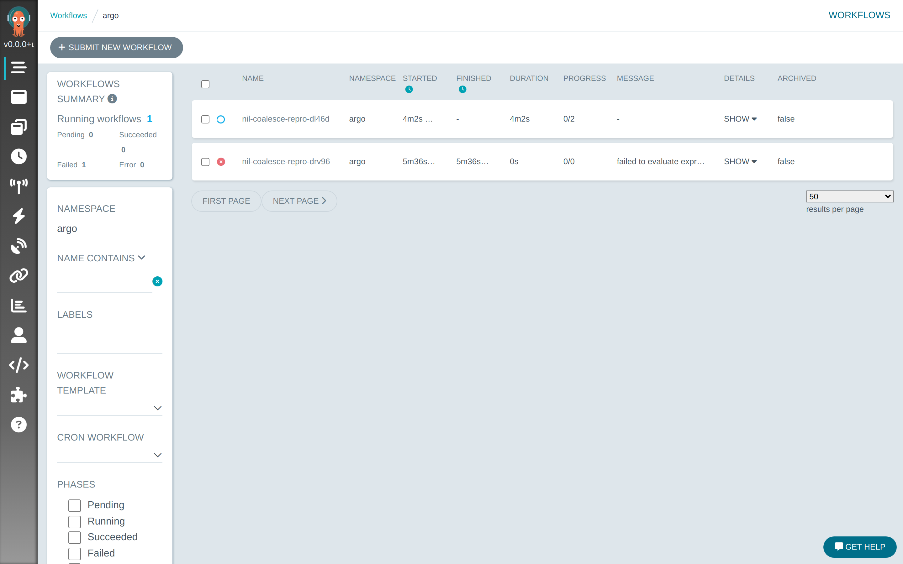
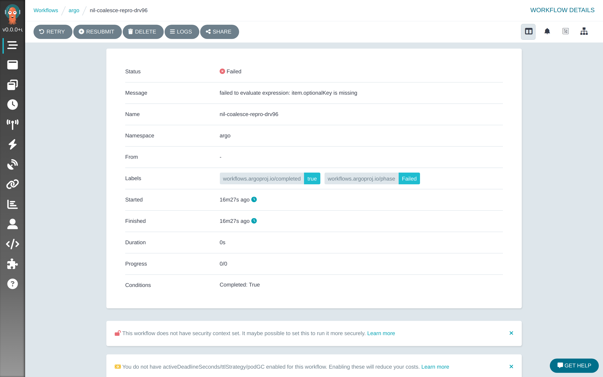
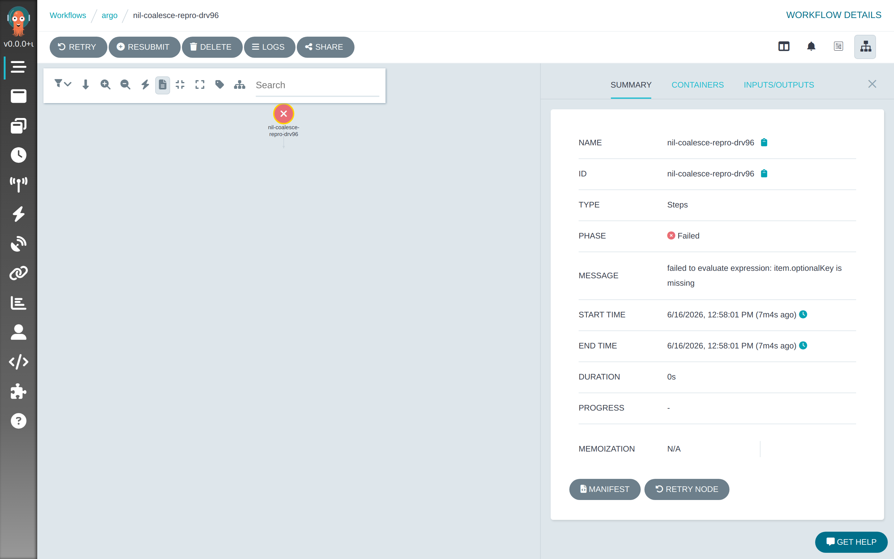
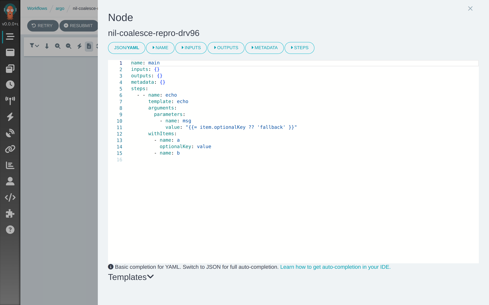
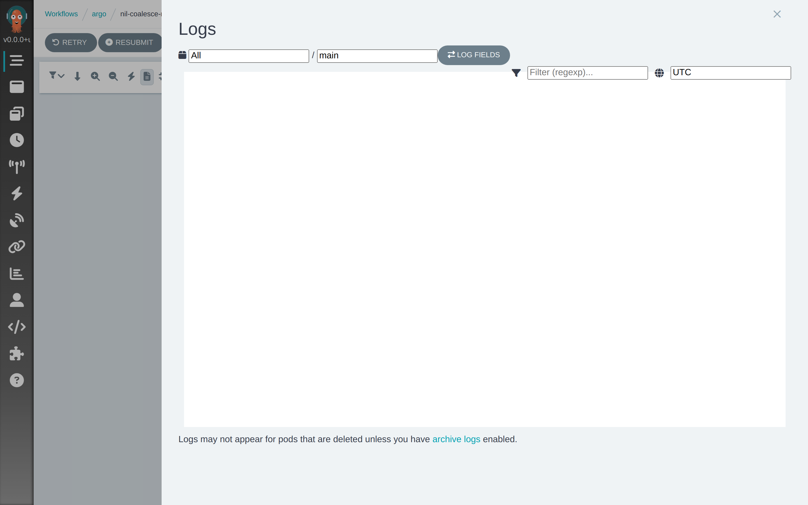
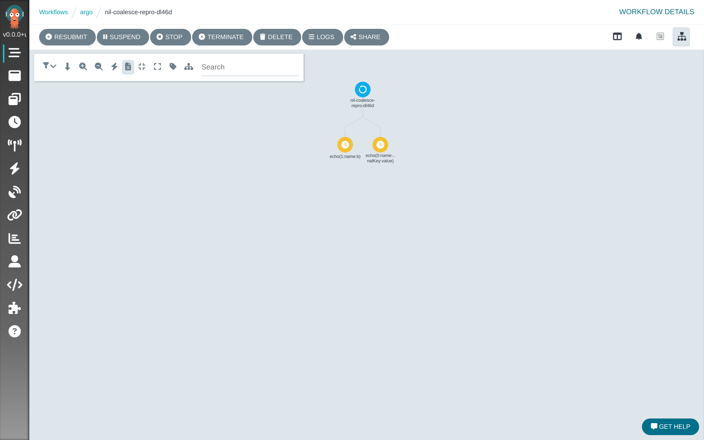
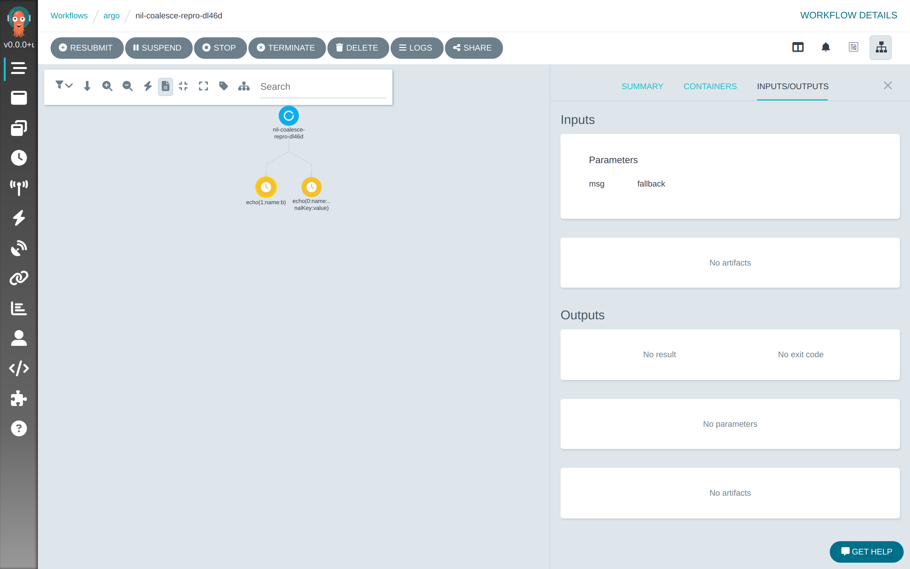
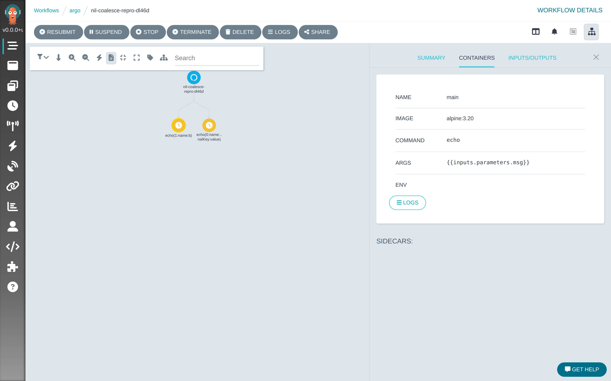

# Strict "is missing" check rejects `??` / `?.`-guarded member paths

> Draft bug report (Argo "Reproducible bug report" template). Fix proposed in **PR #16274**.
> All screenshots below were captured from a **real Argo UI** (`argo server` on `http://localhost:2746`)
> running locally against a live API server, driven by the actual `workflow-controller`.

## Pre-requisites

- [x] I have double-checked my configuration
- [x] I have tested with the `:latest` image tag and can confirm the issue still exists on `:latest` (the strict pre-check in `util/template/expression_template.go` on `main` has no `??` / `?.` awareness — see PR #16274)
- [x] I have searched existing issues and could not find a match for this bug
- [x] I'd like to contribute the fix myself

## What happened? What did you expect to happen?

In `withParam` / `withItems` (and other strict) contexts, the static pre-flight identifier check
rejects an expression that references a map key absent from the item — **even when the reference is
explicitly guarded by the nil-coalescing operator `??` or optional chaining `?.`**, whose entire
purpose is to tolerate the missing value.

A loop over heterogeneous items, where some omit an optional key, fails before evaluation with:

```
failed to evaluate expression: item.optionalKey is missing
```

**Expected:** `item.optionalKey ?? 'fallback'` should resolve the missing key to `fallback`, matching
expr-lang's own runtime semantics (verified against the vendored `expr-lang` v1.17.8: the guarded
expression evaluates with no error and returns the fallback).

**Root cause:** the check (`getIdentifiers` → `identifierVisitor` → `getMemberPath`, introduced in
`d84169f` / #15442) is purely structural. It walks the AST and extracts every `item.<key>` member
path with no awareness that the path is guarded by `??` / `?.`, so a legitimately-optional key is
rejected exactly like a genuinely-undefined variable. This is distinct from #15839, which only fixed
the non-strict (`allowUnresolved=true`) path.

## Evidence (real Argo UI on localhost)

Both workflows were submitted from the same [`repro-workflow.yaml`](repro-workflow.yaml). The
**Failed** one ran under a controller built from the pre-fix code; the **Running** one under a
controller with PR #16274.

### Before the fix

**Workflow list — Failed (pre-fix) vs Running (with PR #16274):**



**Workflow summary — `Failed` with the strict-check message:**



**Node panel — same error on the failed step:**



**Node manifest — the exact guarded expression that was rejected (`value: "{{= item.optionalKey ?? 'fallback' }}"`):**



**Logs view — empty: the workflow failed during expansion, before any pod/wait container was created:**



### After the fix (PR #16274)

**Graph — both `withItems` expand, including `name:b` which omits `optionalKey`:**



**Inputs — the guarded missing key resolves to `fallback`:**



**Containers — the expanded step is ready to run with the resolved parameter:**



## Version(s)

`v3.7.15`; reproduced on `main` (the pre-check in `util/template/expression_template.go` is unchanged
upstream). Present in any version containing #15442.

## Paste a minimal workflow that reproduces the issue

```yaml
apiVersion: argoproj.io/v1alpha1
kind: Workflow
metadata:
  generateName: nil-coalesce-repro-
  namespace: argo
spec:
  entrypoint: main
  templates:
    - name: main
      steps:
        - - name: echo
            template: echo
            withItems:
              - { name: "a", optionalKey: "value" }
              - { name: "b" }
            arguments:
              parameters:
                - name: msg
                  value: "{{= item.optionalKey ?? 'fallback' }}"
    - name: echo
      inputs:
        parameters:
          - name: msg
      container:
        image: alpine:3.20
        command: [echo]
        args: ["{{inputs.parameters.msg}}"]
```

The same failure occurs with bracket notation (`item['optionalKey'] ?? ''`) and optional chaining
(`item?.optionalKey ?? ''`) — all produce the same `item.optionalKey` member path in the AST.

## Logs from the workflow controller

```text
kubectl logs -n argo deploy/workflow-controller | grep ${workflow}

level=ERROR msg="marking node as error" workflow=nil-coalesce-repro-drv96 namespace=argo error="failed to evaluate expression: item.optionalKey is missing" nodeName=nil-coalesce-repro-drv96[0]
level=INFO  msg="step group ... was unsuccessful: failed to evaluate expression: item.optionalKey is missing" workflow=nil-coalesce-repro-drv96 namespace=argo
level=INFO  msg="updated phase" workflow=nil-coalesce-repro-drv96 namespace=argo fromPhase=Running toPhase=Failed
```

## Logs from in your workflow's wait container

```text
kubectl logs -n argo -c wait -l workflows.argoproj.io/workflow=${workflow},workflow.argoproj.io/phase!=Succeeded

# N/A — the workflow fails during withItems/withParam expansion in the controller,
# before any pod (and therefore any wait container) is created. See the empty Logs view above.
```

## Workaround

Reference the key via the `get()` builtin, so no `item.optionalKey` member path is produced:

```
{{= get(item, 'optionalKey') ?? 'fallback' }}
```

## Proposed fix

**PR #16274** adds a `guardVisitor` / `memberMarker` pre-pass that marks member nodes guarded by `??`
or `?.` so they are not treated as strictly-required, while keeping the base variable required so a
genuinely-unavailable variable (e.g. a not-yet-completed task output) still triggers a requeue.

## How these screenshots were produced

No Kubernetes cluster or Docker is required to reproduce. The control plane was a node-less
`kube-apiserver` + `etcd` (via `setup-envtest`); the real `workflow-controller` and `argo server`
(with the UI built to `ui/dist/app`) were built from this repository and run against it on
`localhost`. Screenshots were taken with headless Chromium (Puppeteer).
